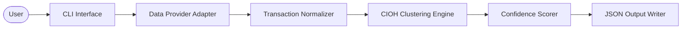
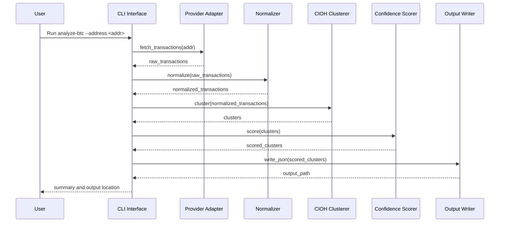
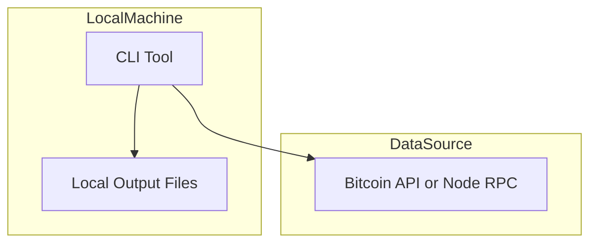

# Architecture Overview

## 1. Scope
This document provides the system architecture needed for the Phase 1 MVP and includes diagrams for component structure, data flow, and deployment.

## 2. Diagrams (PNG)
- High-level architecture: docs/diagrams/hld-architecture.png
- System context and data flow: docs/diagrams/system-design.png

## 3. Component Architecture (Mermaid Source)

## 4. Data Flow (Sequence, Mermaid Source)

## 5. Deployment Diagram (MVP, Mermaid Source)

## 6. Core Modules (MVP)
- cli: argument parsing and orchestration.
- provider: adapter interface for data sources.
- normalizer: provider-specific parsing to internal schema.
- clustering: CIOH implementation.
- scoring: basic confidence rules.
- output: JSON writer and summary.

## 7. Design Rationale
- CIOH chosen for simplicity and established research usage.
- Provider adapter keeps data access separate for easy swapping.
- Normalized schema avoids coupling logic to provider formats.
- JSON output keeps MVP lightweight and easy to inspect.

## 8. Risks
- API rate limits or missing fields.
- Over-clustering due to CIOH limitations.

## 9. Future Extensions
- Change address detection and additional heuristics.
- Graph database integration.
- Ethereum support and cross-chain analytics.
- Web API and dashboard.
